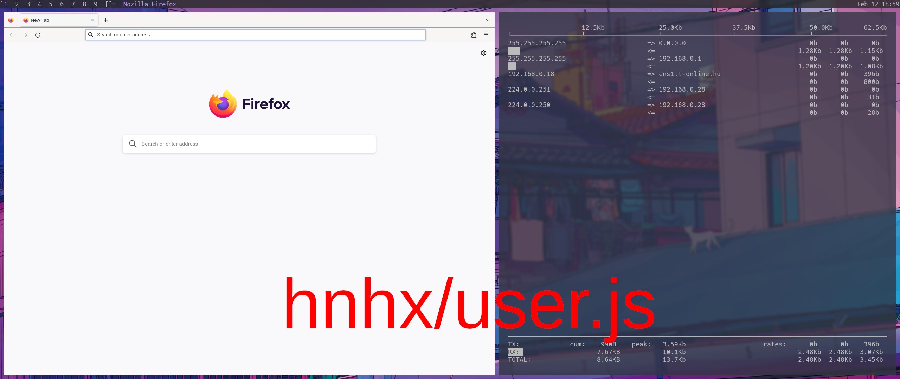

<h1 align="center">hnhx/user.js</h1>
<p align="center">Removes Mozilla spyware from Firefox and makes Firefox more secure</p>

<br>

## About this user.js

This user.js aims at disabling all Firefox telemetry (spyware), it also hardens the browser, installs uBlock Origin and replaces the spyware search engines with privacy respecting ones.

<br>

## Can't I just disable telemetry in the settings?

Just simply disabling telemetry in the settings is not enough anymore, Firefox will still make multiple connections to Mozilla, Google and other servers, some of these connections even persist as long as Firefox is open.

<br>

## How to use (GNU/Linux)

WARNING: This will remove everything from your default profile.

```
git clone https://github.com/hnhx/user.js
cd user.js
./install.sh
```

Optionally you can remove the default plugins that can violate your privacy

```
sudo rm /usr/lib64/firefox/browser/features/*
```

<br>

## Is this any better than arkenfox?

<p align="center">
  
  
</p>

Arkenfox improves on the situation however as you can see on the image Firefox still makes multiple connection to Google and other servers (the firefox related connections are in the red area).
<br><br>
You can replicate the results with the `iftop` tool.

<br>

## Donate ❤️

If you like my projects please consider donating!

Bitcoin (BTC): `bc1qs43kh6tvhch02dtsp7x7hcrwj8fwe4rzy7lp0h`
<br>
Monero (XMR): `41dGQr9EwZBfYBY3fibTtJZYfssfRuzJZDSVDeneoVcgckehK3BiLxAV4FvEVJiVqdiW996zvMxhFB8G8ot9nBFqQ84VkuC`
